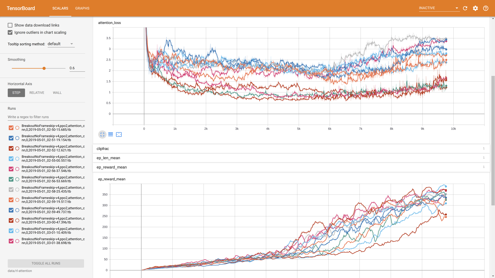

## Interpretability in Reinforcement Learning Agents

[Squares on a regularized model?]

We created a project to try and increase our ability to understand the decision making process that RL agents are using. These methods can be split into *ante hoc* and *post hoc* - whether they are applied during the training of the agent or applied to a given agent respectively. 
Our focus was on combining these methods. Much of the previous work in this area has been applied to image classifiers rather than reinforcement learning agents and the theoretical tools reflect this.

Our initial goal was to train a reinforcement learning agent with an attention layer, and then apply regularization to the activation of the attention layer to promote more meaningful attention maps.
We built on the work of Zhao et al who used an architecture based on Deepmind's Rainbow with the addition of two 

We recreated the bones of this architecture in TensorFlow using the stable-baselines package, using PPO2 but not all of the features of Rainbow.

[Image of our architecture]

An entropy penalty was added to the final activations of the attention tensor.
We ran a number of experiments with different coefficients for the attention loss, settling on a value between 1e-2 and 1e-3 as the region of interest. 

Our results show that at 1e-3 the performance does not seem to be at all reduced but reduced entropy is only weakly incentivized. At 5e-3 entropy of the attention activation is strongly reducd but also reduces performance, with the exception of one run which performed as well as the unregularized models.

While we were doing this we also started to think about ways in which we could better visualise the structure of the RL agent.

The argument for the importance of our work requires the following:
1. We can create datastructures representing trained models that have the capacity to be highly informative about the decision making process.
2. The datastructures are not as informative as they could be because the weights that have been learned are not conducive to being understood in this way.
3. We can find parameterisations of 'informativeness' in this context which allow us to apply regularisation and incentivise the models to act in a comprehensable way.

We started to use Simonyan gradient to visualise the attention gradient and got results that were noisy and had few peaks [image]. Using SmoothGrad and VarGrad gave us less noisy, more specific areas, but we found that the more samples we used, the more washed out the images became, until they hardly gave any information at all.

It started to be clear that neither the pixel based saliency maps nor the activations of the attention layer were a detailed as we would like in explaining behavior.
We therefore started to experiment with creating more detailed structures in order to explain actions.
Instead of simply taking the activation of the attention layer, we started to take the attention layer, take the most important activations, and then recursively take the most important activations of the layer below, to create a tree structure in which the components required for an action were collectively visualised.

[SQUARES]

To select the most important nodes we started using k-means clustering on each layer with the intention of using a gap-statistic to decide on the number of clusters that we should select.
Unfortunately this turned out to be too slow for a goal of making an interactive visualisation tool and so we switched to using a peak detection algorithm to select which neurons to dig down into. 
This is then plotted on top of the stack of input frames. 
This is now being transformed into a Javascript program to allow net surfers to explore the way a trained model plays a game in interactive 3D, selecting the filters that they want to explore and seeing the most relevant nodes drawn out.

